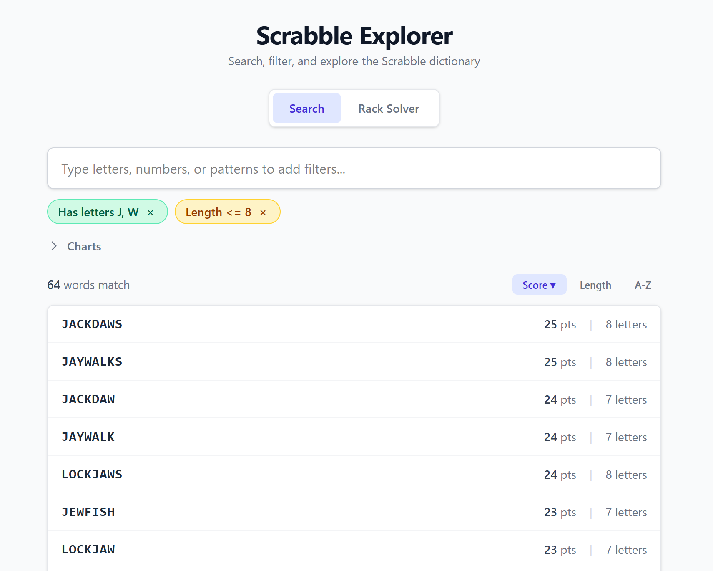
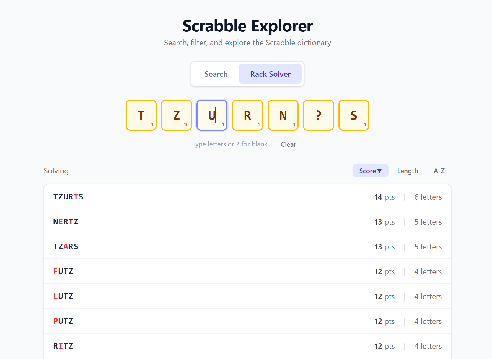

# Scrabble Explorer

An interactive word search and exploration tool for Scrabble players. Build composable queries with filter chips, solve racks, explore word families, and visualize result distributions — all powered by an in-memory DAWG for instant lookups across 178K+ words.





## Features

- **Search with filter chips** — type letters, numbers, or patterns to add stackable filters (has letters, starts/ends with, length, pattern matching, min score, and more). Results update live as chips are added or removed.
- **Rack solver** — enter up to 7 tiles (including blanks with `?`) to find all playable words. Blank tiles score correctly at 0 points and are highlighted in the results.
- **Word cards** — click any word to see its score, letter-by-letter tile breakdown, and full word family tree (extensions and prefixes).
- **Visualizations** — collapsible charts showing score distribution, letter frequency, and length distribution across the full result set.

## Stack

- **Backend:** FastAPI + [scrabble-engine](https://github.com/DeclanFinerty/scrabble-engine) (DAWG, WordQuery, rack solving, word families)
- **Frontend:** React, TypeScript, Vite, Tailwind CSS
- **Dictionary:** TWL06 (Tournament Word List, North American Scrabble)

## Getting started

### Prerequisites

- Python 3.14+, [uv](https://docs.astral.sh/uv/)
- Node.js 18+, npm
- The `scrabble-engine` repo cloned as a sibling directory (`../scrabble-engine`)

### Backend

```bash
uv sync
uv run uvicorn explorer_api.main:app --port 8000
```

### Frontend

```bash
cd frontend
npm install
npm run dev
```

The Vite dev server proxies `/api` requests to the backend at `localhost:8000`.

### Tests

```bash
uv run pytest tests/ -v
```

## Project structure

```
src/explorer_api/         # FastAPI backend
  main.py                 # App setup, DAWG loading, CORS
  models.py               # Pydantic request/response models
  routes/                 # search, word info, rack, families
frontend/src/
  components/             # SearchBar, FilterChip, WordCard, RackInput, charts, etc.
  hooks/                  # useSearch, useRack, useDebounce
  api/client.ts           # API client functions
```

## License

MIT
